

<!-- _class: lead invert -->

# Développer un chatbot pour réserver des vacances

---
<!-- _class: invert global -->

## Problématiques metier

- Réalisation d'un premier MVP
- Utilisation de données extérieures
- Récupérer les informations des conversations
- Surveiller les performances
- Lancer des alertes
- Réentrainer (avec une chaine d'intégration)

---
<!-- _class: invert global -->

## Les données

- Conversation créée pour avoir des dialogues enregistrés
- Slack bot avec 12 humains sur 20 jours: 1369 dialogues

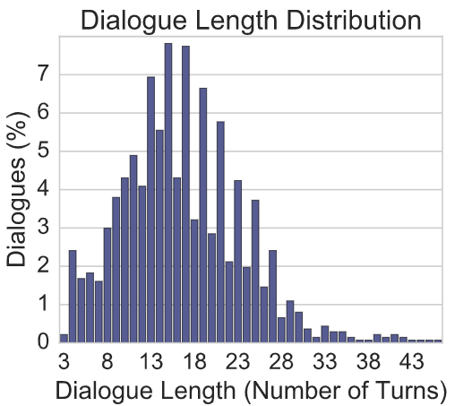

---
<!-- _class: invert global -->

## Le modèle: Conversational Language Understanding

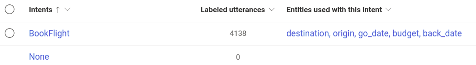
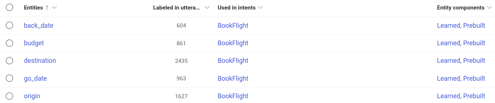

---
<!-- _class: invert global -->

## Entrainement du modèle

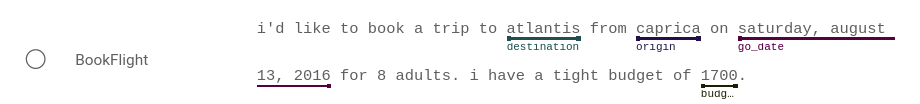

## Résultats

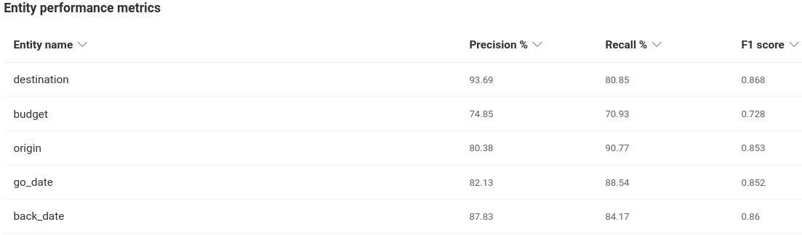

---
<!-- _class: invert global -->

## Web app de chat de réservation de vols

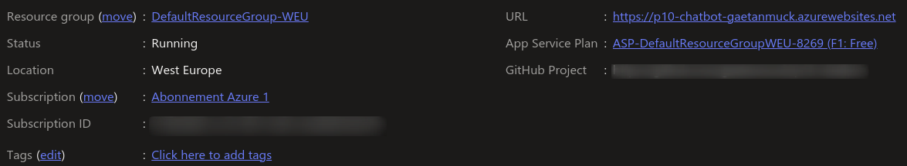

## Intégration continue et tests unitaires

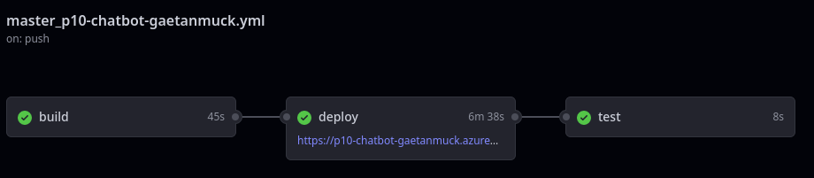

---
<!-- _class: invert global -->

## Interface de chat

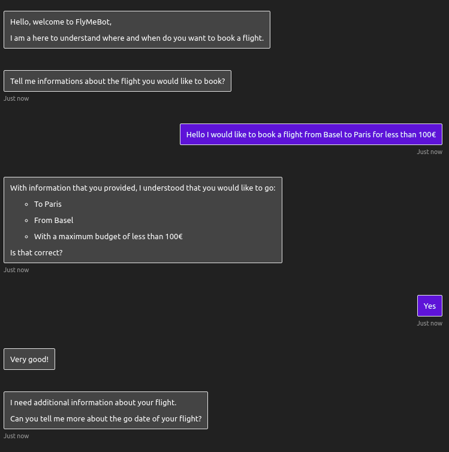

---
<!-- _class: invert global -->

## Surveillance des performances et historique

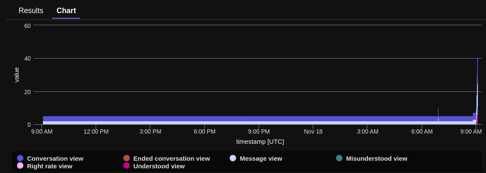

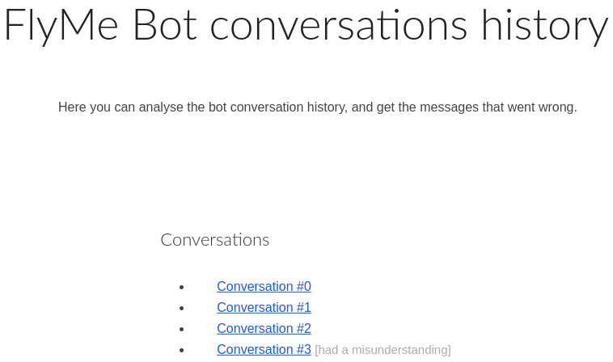

---
<!-- _class: invert global -->

## Mise à jour du modèle

- Scripts automatisés : entrainement, déploiement, tests unitaires

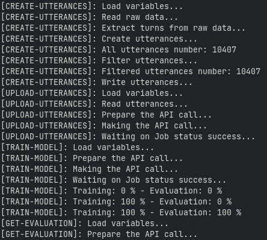

---
<!-- _class: invert global -->

## Problème rencontrés

- Application Azure LUIS non disponible (changement vers le CLU)
  => Solution : Utilisation du CLU

- Déploiement sur Azure non fonctionel
  => Solution : Déploiement sur un VPS

- Lancement d'alertes non disponible (payement requis)
  => Solution pour le MVP : surveillance visuelle des seuils et des historiques

---
<!-- _class: invert global -->

## Chaîne d'intégration future

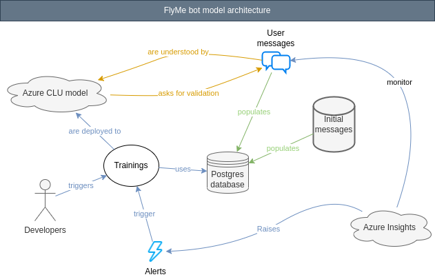

---
<!-- _class: invert global -->

## Conclusions

- MVP disponible en ligne
- Avoir nos propre données
- Construire notre propre système de surveillance et d'alerte
- Collecter des retours sur les fonctionnalités du Chatbot
